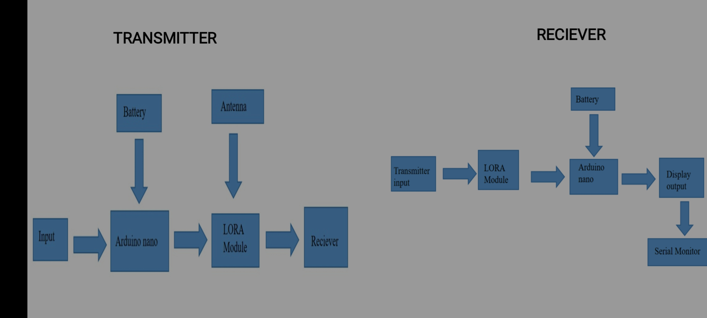

# 📡 Serial Communication via LoRa RF96

> A wireless communication system using LoRa RF96 modules to transmit and receive serial data with Arduino Nano — built for range, modularity, and minimal power consumption.

---

## 🔧 Tech Stack

- Arduino Nano
- LoRa RF96 (SX1278) Modules
- SPI Communication Protocol
- Serial Monitor Interface
- (Optional) Boost Converter for 3.3V regulation

---

## 🚀 Features

- Wireless Serial Communication across long distances
- Clean and organized folder structure
- Modular code for easy reuse
- README-driven documentation for recruiters & contributors

---

## 📁 Folder Structure
---

## 📸 Block Diagram

(Upload your block diagram image into the Report/ folder and update the link below)

---

## 🖥 How It Works

1. User enters input in the Serial Monitor on the *Transmitter* side.
2. LoRa RF96 sends this data wirelessly at 915 MHz.
3. *Receiver* captures and prints the message in its Serial Monitor.

---

## 🎯 Use Cases

- Remote control systems
- Field-based sensor communication
- Wireless logging for agriculture, environment, or robotics
- IoT gateway projects without WiFi or Bluetooth

---

## 🧠 Skills Demonstrated

- SPI communication with Arduino
- LoRa module interfacing
- Clean GitHub documentation
- Modular coding & embedded system design

---

## 📜 License

This project is licensed under the [MIT License](./LICENSE) — you’re free to use, distribute, and adapt with proper attribution.

---

## 🙌 Let’s Connect

Made with focus and curiosity by [Niranjan](https://github.com/niranjanmeti)  
Feel free to ⭐ this repo or reach out if you’d like to collaborate!
